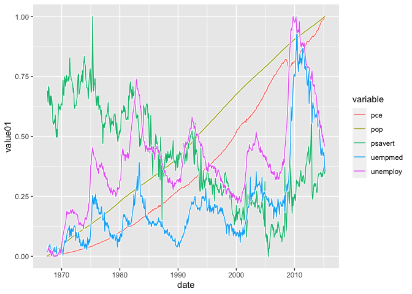
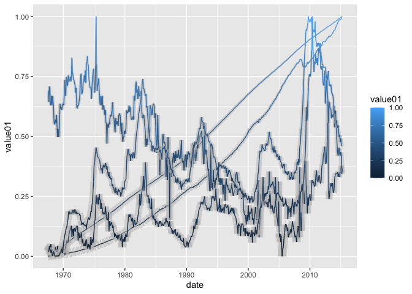

# `ggshadow`: Shadow Geoms for ggplot2


## :arrow_double_down: Installation


Get the development version from github:

```r
## install.packages("devtools")
devtools::install_github("marcmenem/ggshadow")
```


## :book: Vignette

```r
## after installing the package
vignette("ggshadow", package="ggshadow")
```

## :chart: Example

### With ggshadow

```{r}
library(ggplot2)
library(ggshadow)

ggplot(economics_long, aes(date, value01, colour = variable)) + geom_shadowline()

```




### Without ggshadow

```{r}
library(ggplot2)

ggplot(economics_long, aes(date, value01, colour = variable)) + geom_line()

```


### `ggshadow` supports varying the line color

```{r}
library(ggshadow)
library(ggplot2)

ggplot(economics_long, 
        aes(date, value01, 
            group = variable, 
            colour=value01, 
            shadowcolor='grey', 
            shadowalpha=0.5, 
            shadowsize=5*(1-value01))) + 
    geom_shadowline()

```




### `ggshadow` also provides a Neon glow style


```{r fig.height=7, fig.width=7}

ggplot(economics_long, aes(date, value01, color = variable)) + 
  geom_glowline() + guides(color='none') + 
  theme(plot.background = element_rect(fill = "#190132"),
        panel.background = element_rect(fill = "#190132")) 

```


### Neon glow points

```{r}

ggplot(mtcars, aes(wt, mpg)) + 
  geom_glowpoint(color='yellow') + 
  guides(color='none') + 
  theme(plot.background = element_rect(fill = "#190132"),
        panel.background = element_rect(fill = "#190132")) 

```


